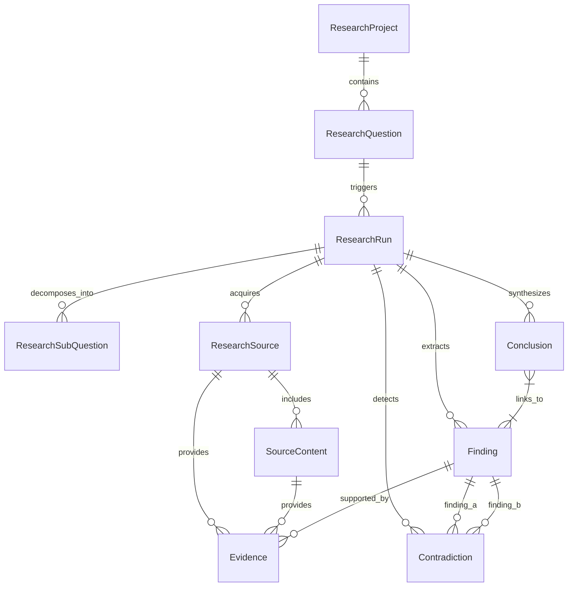

# Enterprise Research Data Model & Traceability

## Overview

The Enterprise Research Intelligence Platform stores structured, persistent, and fully traceable research knowledge. Unlike an ephemeral chatbot, every statement, finding, contradiction, and conclusion generated by the platform remains deterministically linked back to its underlying evidence fragments, sub-questions, and external sources.

## Entity-Relationship Diagram

## Core Entities

### 1. ResearchProject
- **Purpose**: Represents a persistent research workspace around a corporate domain or industry topic.
- **Key Fields**: `id` (UUID), `name`, `description`, `research_topic`, `industry`, `status`, `created_at`, `updated_at`.

### 2. ResearchQuestion
- **Purpose**: Represents a specific question or sub-inquiry submitted by a user within a project.
- **Key Fields**: `id` (UUID), `project_id` (FK), `question`, `status`, `created_at`, `updated_at`.

### 3. ResearchRun
- **Purpose**: Represents a distinct execution run for a research question, providing execution traceability across runs.
- **Key Fields**: `id` (UUID), `question_id` (FK), `status` (`queued`, `running`, `completed`, `failed`), `started_at`, `completed_at`, `error_message`, `metadata_json`, `created_at`.

### 4. ResearchSubQuestion
- **Purpose**: Represents a decomposed sub-inquiry generated during Stage 1 of the pipeline.
- **Key Fields**: `id` (UUID), `research_run_id` (FK), `question`, `sequence_number`, `status` (`pending`, `completed`, `failed`), `created_at`, `completed_at`.

### 5. ResearchSource
- **Purpose**: Represents an external document, article, paper, or web URL retrieved during research.
- **Key Fields**: `id` (UUID), `research_run_id` (FK), `title`, `url`, `publisher`, `published_at`, `retrieved_at`, `source_type`, `credibility_score`, `metadata_json`, `created_at`.

### 6. SourceContent
- **Purpose**: Represents extracted text/content or document chunks from a research source.
- **Key Fields**: `id` (UUID), `source_id` (FK), `content`, `content_hash`, `word_count`, `extraction_status`, `metadata_json`, `created_at`, `updated_at`.

### 7. Finding
- **Purpose**: Represents an atomic structured insight extracted from raw sources.
- **Key Fields**: `id` (UUID), `research_run_id` (FK), `statement`, `finding_type` (`fact`, `trend`, `claim`, `observation`, `prediction`, `risk`, `opportunity`), `confidence`, `importance`, `created_at`, `updated_at`.

### 8. Evidence
- **Purpose**: Explicitly links a `Finding` to the exact `ResearchSource` and `SourceContent` excerpt from which it was derived.
- **Key Fields**: `id` (UUID), `finding_id` (FK), `source_id` (FK), `source_content_id` (FK), `excerpt`, `relevance_score`, `evidence_type` (`supporting`, `contradicting`, `contextual`), `created_at`.

### 9. Contradiction
- **Purpose**: Captures conflicting claims between two findings identified during research synthesis.
- **Key Fields**: `id` (UUID), `research_run_id` (FK), `finding_a_id` (FK), `finding_b_id` (FK), `description`, `severity`, `resolution_status`, `resolution_notes`, `created_at`.

### 10. Conclusion
- **Purpose**: Represents a high-level synthesized conclusion derived from multiple findings.
- **Key Fields**: `id` (UUID), `research_run_id` (FK), `statement`, `confidence`, `created_at`, `updated_at`.
- **Many-to-Many Link**: Explicit association table `conclusion_findings` links `Conclusion` to member `Finding` records.
